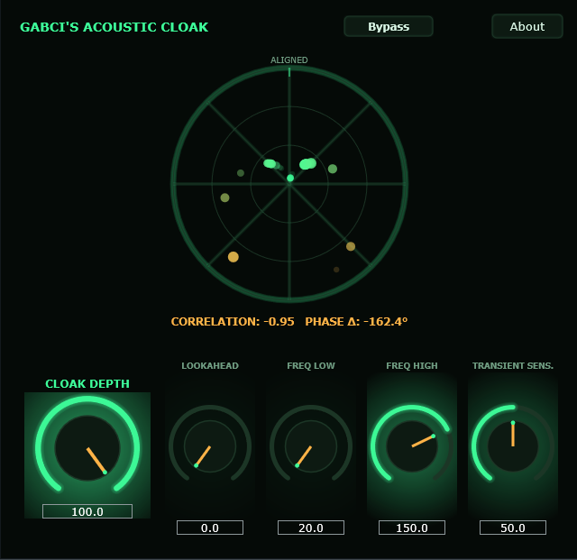

# Gabci's Acoustic Cloak

> Transient-aware phase cloaking that clears room for the kick inside the bass.

[](LICENSE)
[](https://github.com/rcptr2/gabcis-acoustic-cloak/actions/workflows/build.yml)


🇭🇺 *A magyar leírás: [README.hu.md](README.hu.md)*



*The phase radar showing the current bass-versus-kick relationship, with the live correlation and phase delta below it.*

Sidechain compression solves the kick-versus-bass collision by turning the bass down. Acoustic Cloak
solves it without a level change: for the duration of each kick transient it rotates the phase of the
bass inside a narrow target band, so the bass steps out of the kick's way and steps back in when the
transient has passed. The perceived loudness of the bass stays where it was — only the interference
disappears.

Built with [JUCE](https://juce.com). The `processBlock` is allocation-free on the audio thread.

## How it works

- **Bus layout** — a stereo Main input and output (the bass) plus an optional Sidechain input bus
  (disabled by default, mono or stereo — the kick).
- **Band isolator** — narrows the treatment to the region between Target Freq Low and Target Freq
  High, so nothing outside the collision zone is touched.
- **Allpass/Hilbert network** — builds the quadrature pair needed for continuous, magnitude-preserving
  phase rotation inside the isolated band.
- **Resonator bank** — a set of complex resonators tracks the band's tonal content so the rotation
  follows the material rather than a fixed setting.
- **Phase correlation analyser** — measures the bass-versus-kick relationship that drives the cloak.
- **Transient detection** — the cloak engages on kick transients and releases afterwards, controlled
  by Transient Sensitivity.
- **Phase radar display** — a polar visualisation of the current phase relationship.

`Lookahead` is a plain delay line on the Main path that reserves temporal margin for the rotator. The
resulting latency is reported to the host, and the notification is deferred to the message thread —
changing reported latency from the audio thread causes dropouts in most DAWs.

## Parameters

| Parameter | Range | Default | Description |
|---|---|---|---|
| Cloak Depth | 0 – 100 % | 100 % | How strongly the phase is rotated during a kick transient. |
| Lookahead | 0 – 20 ms | 0 ms | Temporal margin for the rotator; reported to the host as latency. |
| Target Freq Low | 20 – 200 Hz | 20 Hz | Lower edge of the treated band. |
| Target Freq High | 30 – 300 Hz | 150 Hz | Upper edge of the treated band. |
| Transient Sensitivity | 0 – 100 % | 50 % | Threshold at which a kick transient engages the cloak. |
| Bypass | on / off | off | Full bypass. |

## Installation

Pre-built binaries are on the
[Releases](https://github.com/rcptr2/gabcis-acoustic-cloak/releases) page.

### Windows x64

1. Download `AcousticCloak-vX.Y.Z-Windows-x64-VST3.zip`.
2. Unzip it and copy the `Acoustic Cloak.vst3` folder into `C:\Program Files\Common Files\VST3\`.
3. Rescan plug-ins in your DAW.

### macOS (Intel)

The macOS binary is **x86_64 (Intel)**. It runs natively on Intel Macs and under Rosetta 2 in an
Intel-mode host on Apple Silicon; there is no arm64 slice.

1. Download `AcousticCloak-vX.Y.Z-macOS-Intel-VST3.zip`.
2. Unzip it and copy `Acoustic Cloak.vst3` into `/Library/Audio/Plug-Ins/VST3/`
   (or `~/Library/Audio/Plug-Ins/VST3/` for the current user only).
3. The build is not notarised, so clear the quarantine flag:
   ```bash
   xattr -dr com.apple.quarantine "/Library/Audio/Plug-Ins/VST3/Acoustic Cloak.vst3"
   ```
4. Rescan plug-ins in your DAW.

### Routing

Place Acoustic Cloak on the bass track and route the kick to its sidechain input.

## Building from source

### Requirements

- CMake 3.24 or newer
- A C++20 compiler — **Visual Studio 2022** (Desktop development with C++) on Windows,
  **Xcode 15+** on macOS
- Git

JUCE 9.0.0 is pinned in `CMakeLists.txt` and downloaded automatically by CMake's `FetchContent` at
configure time. MinGW is not supported: JUCE rejects it explicitly, and its Windows backend needs
MSVC intrinsics and the Direct2D/DirectWrite headers.

> **The build directory path must not contain an apostrophe.** JUCE's generated VST3 `POST_BUILD`
> steps do not escape apostrophes in the shell command chains they emit. `CMakeLists.txt` checks for
> this and stops with a clear error rather than failing later.

### Windows

```bash
cmake -S . -B build -G "Visual Studio 17 2022" -A x64 -DACOUSTICCLOAK_BUILD_TESTS=OFF
cmake --build build --config Release --target AcousticCloakPlugin_VST3
```

### macOS

```bash
cmake -S . -B build -G Xcode -DCMAKE_OSX_ARCHITECTURES=x86_64 -DACOUSTICCLOAK_BUILD_TESTS=OFF
cmake --build build --config Release --target AcousticCloakPlugin_VST3
```

The finished bundle is written to
`build/AcousticCloakPlugin_artefacts/Release/VST3/Acoustic Cloak.vst3`.

### Tests

The suite uses [Catch2](https://github.com/catchorg/Catch2), fetched automatically, and registers
with CTest:

```bash
cmake -S . -B build -DACOUSTICCLOAK_BUILD_TESTS=ON
cmake --build build --config Release
ctest --test-dir build -C Release --output-on-failure
```

A separate console app, `AcousticCloakLoadTest`, measures per-block CPU cost.

## Project layout

```
Source/          Plug-in source — processor, editor, band isolator, Hilbert network,
                 resonator bank, correlation analyser, phase radar, look and feel
Tests/           Catch2 unit tests and a CPU load-test console app
docs/            Design blueprint and PDF overviews (EN/HU)
CMakeLists.txt   Build definition; pins JUCE 9.0.0
CHANGELOG.md     Development history, phase by phase
```

## Tested with

- **macOS** (Intel, x86_64) — FL Studio 2026
- **Windows 11 x64** — FL Studio 2026

## Performance


Measured in FL Studio 2026 on Windows 11 x64, on an ASUS ZenBook 13 with an Intel
Core i7-1065G7 — a low-power four-core laptop CPU, not a workstation. All seven
plug-ins ran simultaneously in the same project, with two stock Image-Line plug-ins
included for reference. The figures are FL Studio's own, captured with
*Reset on transport* enabled so that one-off initialisation spikes are excluded.

| Plug-in | CPU % | Time | Peak |
|---|---:|---:|---:|
| Gabci's AeroDynamics Pro | 17 | 251 | 353 |
| FLEX Bass *(Image-Line, reference)* | 9 | 125 | 275 |
| Gabci's MasterClear | 4 | 53 | 264 |
| Gabci's SmartMask Network *(instance 1)* | 3 | 43 | 554 |
| Gabci's PhaseLock Sub | 3 | 41 | 1306 |
| Emphasizer *(Image-Line, reference)* | 2 | 34 | 117 |
| **Gabci's Acoustic Cloak** | **2** | **36** | **191** |
| Gabci's MorphicPhaser | 2 | 27 | 152 |
| Gabci's SmartMask Network *(instance 2)* | 1 | 16 | 498 |
| Gabci's SpectralCarve Pro | 1 | 19 | 751 |

## Licence

Released under the **GNU Affero General Public License v3.0 or later** — see [LICENSE](LICENSE).

This choice is not arbitrary. Acoustic Cloak is built with JUCE 9, which is dual-licensed under the
AGPLv3 and a commercial JUCE licence. Distributing a binary built from this source under the AGPLv3
branch is what makes it free to publish, and it obliges any derived work to be released under the
same terms with its source available.

## Attribution

- [JUCE](https://juce.com) — © Raw Material Software Limited, used here under the AGPLv3.
- [Catch2](https://github.com/catchorg/Catch2) — Boost Software License 1.0 (test builds only).
- VST® is a registered trademark of Steinberg Media Technologies GmbH. The VST 3 SDK bundled with
  JUCE is distributed by Steinberg under the MIT licence.

## Author

Gábor Tomori — *Gabci Audio*
